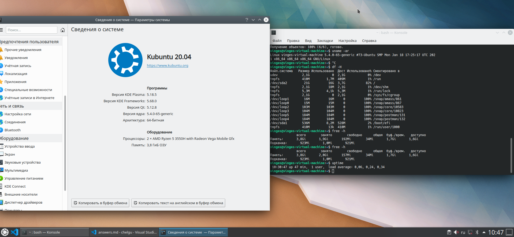

1) Основные принципы Unix-way  
	* Одна задача - одна программа  
	* Есть множество путей решения  
	* Все есть файл
	
2) Линус Торвальдс является разработчиком чего  
	Ядра ОС Linux 
	
3) Как посмотреть  название ядра системы из консоли?   
	`uname -r`
	
4) Промежутки измерения загрузки системы для команды uptime следующие  
	1,5,15 минут
	
5) какой командой узнать сколько занято на HDD  
	`df -H`
	
6) какие разделы содержит вывод команды vmstat
	* procs (количество процессов)
	* memory (память)
	* swap (файл подкачки)
	* io (загрузка ввода-вывода)
	* cpu (загрузка процессора)
	
7) Описать работу своего Linux дистрибутива: какое ядро, архитектура, размеры hdd, объеме ОЗУ, загрузке процессора и т.д  

    * Ядро, архитектура:  
        ```
        vinges@vinges-virtual-machine:~$ uname -ar
        Linux vinges-virtual-machine 5.4.0-65-generic #73-Ubuntu SMP Mon Jan 18 17:25:17 UTC 2021 x86_64 x86_64 x86_64 GNU/Linux
        ```
    * Информация HDD:  
        ```
        vinges@vinges-virtual-machine:~$ df -H
        Файл.система   Размер Использовано  Дост Использовано% Cмонтировано в
        udev             2,1G            0  2,1G            0% /dev
        tmpfs            410M         1,7M  409M            1% /run
        /dev/sda2         21G          16G  3,7G           82% /
        tmpfs            2,1G          18M  2,1G            1% /dev/shm
        tmpfs            5,3M         4,1k  5,3M            1% /run/lock
        tmpfs            2,1G            0  2,1G            0% /sys/fs/cgroup
        /dev/loop1        16M          16M     0          100% /snap/amass/861
        /dev/loop0        15M          15M     0          100% /snap/amass/867
        /dev/loop2       103M         103M     0          100% /snap/core/10583
        /dev/loop3       104M         104M     0          100% /snap/core/10823
        /dev/loop5       184M         184M     0          100% /snap/postman/131
        /dev/loop4       184M         184M     0          100% /snap/postman/132
        /dev/sda1        536M         8,2M  528M            2% /boot/efi
        tmpfs            410M          13k  410M            1% /run/user/1000
        ```

    * Информация ОЗУ:  
        ```
        vinges@vinges-virtual-machine:~$ free -h
                    всего        занято        свободно      общая  буф./врем.   доступно
        Память:       3,8Gi       1,9Gi       192Mi        34Mi       1,7Gi       1,6Gi
        Подкачка:       923Mi       1,0Mi       921Mi
        ```

    * Загрузка процессора:  
        ```
        vinges@vinges-virtual-machine:~$ uptime
        10:30:47 up 47 min,  1 user,  load average: 0,06, 0,24, 0,34
        ```
