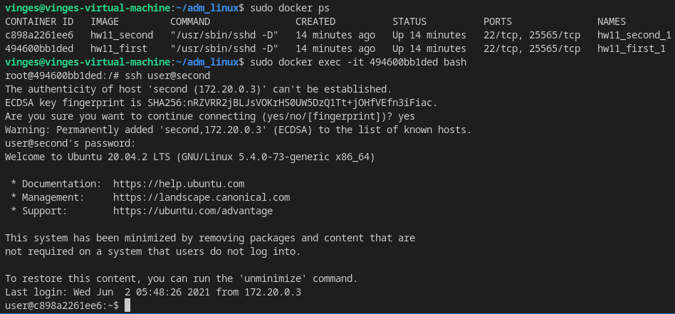
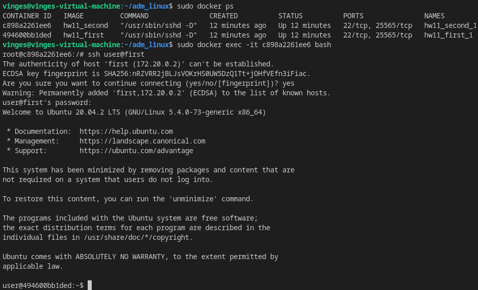
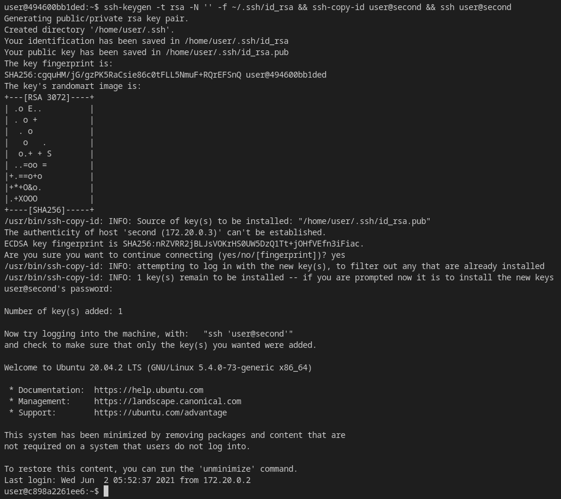
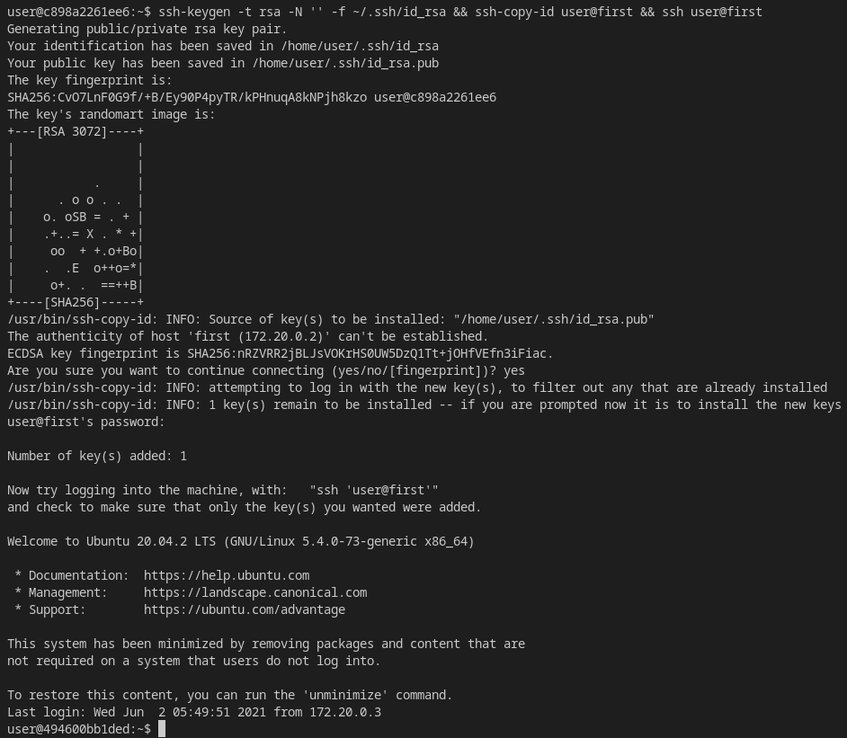
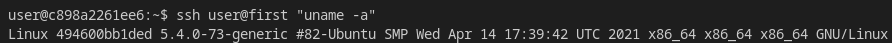
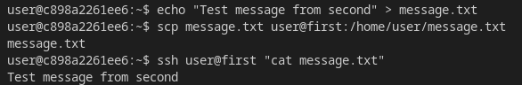
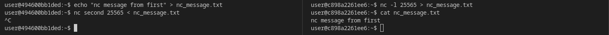

# Практика
* сделать image контейнера с необходимым ПО для запуска sshd  
    [Dockerfile](Dockerfile)  
    [docker-compose.yml](docker-compose.yml)
* запустить docker-compose поднять два ssh сервера  
    ```bash
    sudo docker-compose build && sudo docker-compose up
    ```
* продемонстрировать что из одного контейнера можно войти в другой  
    * по паролю  
        * 1 -> 2  
            
        * 2 -> 1  
            
    * по ключу  
        * 1 -> 2  
            
        * 2 -> 1  
            
* выполнить команду  
    
* передать файл  
    
* продемонстрировать простейший обмен данными с помощью утилиты netcat  
    