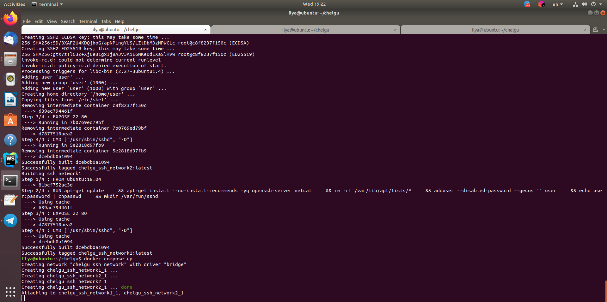
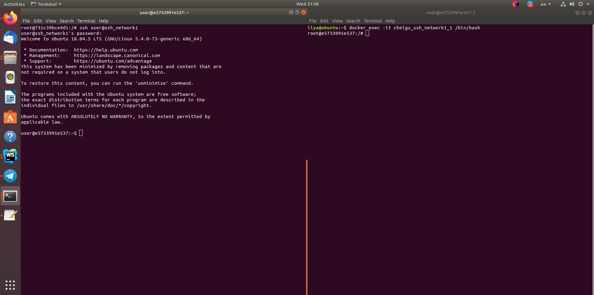

# Теория
## 1) Каким уровнем называется физический уровень и что в него входит
Физический уровень — первый уровень сетевой модели OSI, физическая и электрическая среда для передачи данных.  Осуществляет работу со средой передачи, сигналами и двоичными данными.
## 2) Управление потоками данных происходит на
На транспортном уровне
## 3) Какие протоколы работают на третьем уровне?  и для чего используются?
* IP (IPv4,IPv6) объединяет сегменты сети в единую сеть, обеспечивая доставку пакетов данных между любыми узлами сети через произвольное число промежуточных узлов (маршрутизаторов).
* ICMP используется для передачи сообщений об ошибках и других исключительных ситуациях, возникших при передаче данных
## 4) Какой протокол обеспечивает функцию фрагментации пакетов и что это такое ?

Функцию фрагментации пакетов обеспечивает IP.
Фрагментация пакетов - процесс, который разбивает пакеты на более мелкие фрагменты.

## 5) Поле "Смещение флагов" в заголовке пакета IP содержит ?
Смещение передаваемых данных относительно начала данных в фрагментированном пакете
## 6) Напишите пример подсети которая относится к классу C:
1.0.0.0/255.255.255.0
## 7) Напишите пример фейковой подсети класса А.
10.0.0.0/255.0.0.0
## 8) Какой командой добавить к текущему IP-адресу на интерфейсе eth0 адрес 10.15.35.1?
```bash
ifconfig eth0 add 10.15.35.1
```
## 9) Напишите команду добавления маршрута к сети через шлюз 192.168.2.1 10.15.35.0/255.255.255.0?
```bash
route add 10.15.35.0 netmask 255.255.255.0 gw 192.168.2.1
```
## 10) Какие вы знаете протоколы верхних уровней на базе UDP и их назначение?
* DNS – протокол уровня приложений, позволяющий преобразовывать символьные имена интернет-хостов в IP-адреса
* DHCP — сетевой протокол, позволяющий сетевым устройствам автоматически получать IP-адрес и другие параметры, необходимые для работы в сети TCP/IP
## 11) Какой порт использует DNS для пересылки информации между зонами?
53/TCP
## 12) Поле "сдвиг данных" в заголовке протокола TCP содержит
длину заголовка в 32-разрядных словах
## 13) Первым пакетом в последовательности установки соединения в протоколе TCP передается пакет с установленными флагами… 
SYN
## 14) Технология установки соединения в протоколе TCP называется 
Three-way handshake
## 15) Примеры сервисрв, использующие протокол TCP в качестве транспортного:
HTTP, FTP, SMTP, POP3
## 16) Опишите принцип работы traceroute
Для определения промежуточных маршрутизаторов traceroute отправляет целевому узлу серию ICMP-пакетов (по умолчанию 3 пакета), с каждым шагом увеличивая значение поля TTL на 1. Это поле обычно указывает максимальное количество маршрутизаторов, которое может быть пройдено пакетом. 

Первая серия пакетов отправляется с TTL, равным 1, и поэтому первый же маршрутизатор возвращает обратно ICMP-сообщение «time exceeded in transit», указывающее на невозможность доставки данных. Traceroute фиксирует адрес маршрутизатора, а также время между отправкой пакета и получением ответа. Затем traceroute повторяет отправку серии пакетов, но уже с TTL, равным 2, что заставляет первый маршрутизатор уменьшить TTL пакетов на единицу и направить их ко второму маршрутизатору. Второй маршрутизатор, получив пакеты с TTL=1, так же возвращает «time exceeded in transit».
Процесс повторяется до тех пор, пока пакет не достигнет целевого узла. При получении ответа от этого узла процесс трассировки считается завершённым.
## 17) Какой тип icmp запросов используется в ping утилите
* Тип 0 - эхо-ответ
* Тип 8 - эхо-запрос

# Практика
##1) Произвести настройку IP адреса сетевого интерфейса eth0 через конфиг и на лету

##2) Остановить и запустить сетевой интерфейс eth0

##3) Произвести смену аппаратного (MAC) адреса сетевого интерфейса eth0;

##4) Показать таблицу сетевых маршрутов. Установить маршрут по умолчанию
