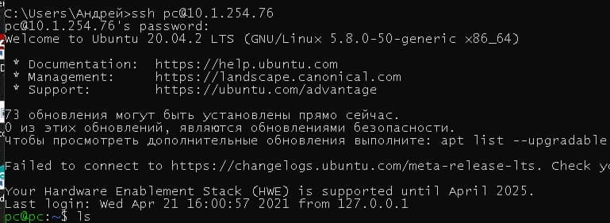
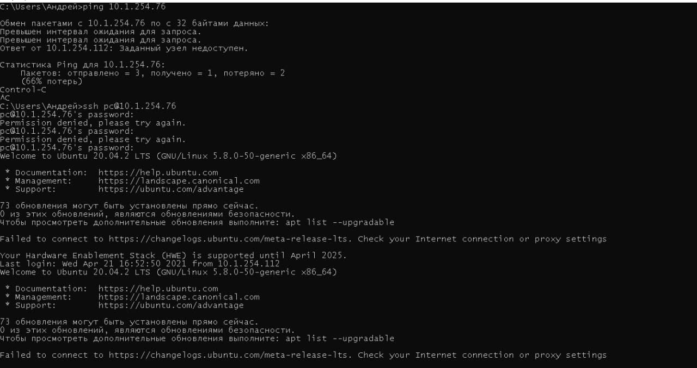
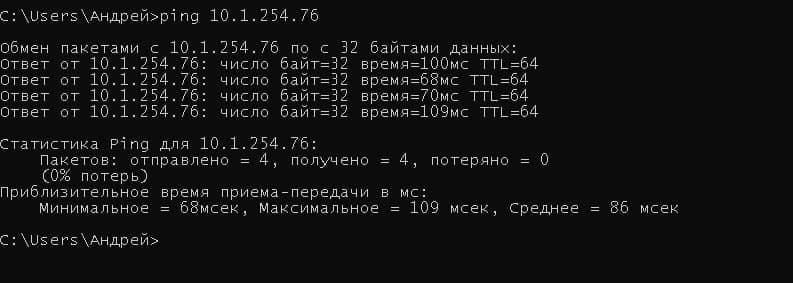

# Теория
## 1) Какие базовые цепочки и таблицы существуют в iptables и для чего служат?
 - цепочки:
   - PREROUTING — пакеты ДО маршрутизации
   - INPUT — пакеты, предназначенные текущему хосту
   - FORWARD — транзитные пакеты
   - OUTPUT — пакеты от текущего хоста
   - POSTROUTING — все исходящие пакеты 
 - таблицы:
   - MANGLE — классификация и маркировка пакетов и соединений, модификация заголовков
   - NAT — преобразование сетевых адресов и портов
   - FILTER — фильтрация трафика
   - SECURITY — изменение маркировок безопасности
   - RAW — действия с пакетами до обработки conntrack
   - RAWPOST — подмена исходного трафика без использования информации о соединении
## 2) Опишите процесс обработки пакета который предназначен данной системе
 - PREROUTING -> INPUT -> Локальный процесс, которому назначался пакет -> OUTPUT -> POSTROUTING
## 3) Что такое conntrack и для чего используется?
- conntrack отслеживает все логические сетевые соединения, чтобы идентифицировать пакеты из одного потока для дальнейшего использования их вместе
## 4) Какими командами создать/удалить цепочку? создать/удалить правило? создать правило до определенного правила в цепочке?
 - создать цепочку: iptables -N NEWCHAIN
 - удалить цепочку: iptables -X NEWCHAIN
 - создать правило: iptables -A NEWCHAIN [arguments]
 - до конкретного: iptables -I NEWCHAIN [N] [arguments]
 - удалить правило: iptables -D NEWCHAIN
# Практическая часть:
## Поднять в системе ssh сервер. 
```bash
 $ iptables-restore chelgu_iptables
 $ systemctl start ssh
```
## 1) Настроить правила которые разрешают доступ на этот сервер с определенной подсети или хоста в которой находитесь вы как клиент, продемонстрировать что работает icmp
Скриншоты с системы одногруппника, т.к. была проблема с виртуалкой. Настраивал iptables и запустил ssh на своей системе. Тестировал с системы одногруппника, оттуда и скриншоты
```bash
 $ iptables -I INPUT -s 10.1.254.112 -j ACCEPT
```


## 2) затем закрыть доступ из этой подсети по icmp, осавив доступ по ssh, продемонстрировать что хост по ssh доступен а icmp нет
```bash
 $ iptables -I INPUT -s 10.1.254.112 -j DROP
 $ iptables -I INPUT -s 10.1.254.112 -p tcp --dport 22 -j ACCEPT
```


## 3) Запретить только ssh , продемонстрировать что icmp работает
```bash
 $ iptables -I INPUT -s 10.1.254.112 -p tcp --dport 22 -j DROP
```

