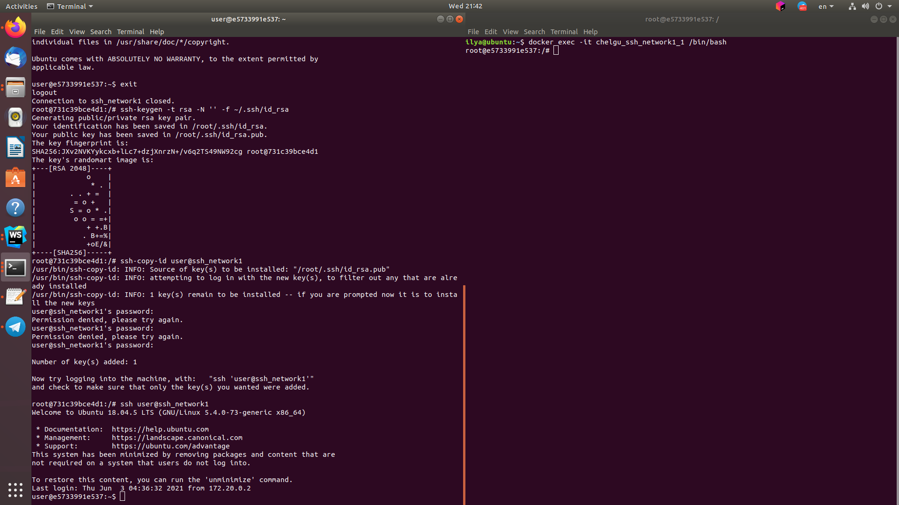
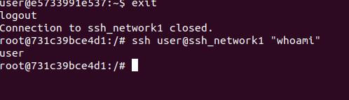

## Теория
### Что такое RAID для каких целей он используется?
    RAID - дисковый массив из нескольких дисков. Используется для повышения надежности и/или повышения скорости работы дисковых устройств
### Объясните различия между Raid0, Raid1 и Raid5? Плюсы минусу, принцип.
    Raid0 - массив дисков с чередованием данных. Обладает высокой скоростью записи и чтения, однако имеет самую низкую надежность хранения, поскольку выход любого диска приводит к потере всего массива.
    Raid1 - зеркалированный массив, в котором запись идет на все диски сразу. Обладает наибольшей степенью надежности и высокой скоростью чтения, однако наименее эффективно использует дисковое пространство.
    Raid5 - массив дисков с поблочным чередованием. Позволяет проводить параллельную запись, обладает повышенной скоростью чтения, высокой эффективностью использования дискового пространства и допускает выход из строя одного из дисков. Однако в случае потери одного диска повышается нагрузка на остальные из-за процесса восстановления RAID.
### Что такое Raid 10?
    RAID10 - массив дисков с зеркалированием и чередованием (массив RAID0 из нескольких RAID1).
### Aппаратный, софтфовый и fake raid что это?
    Аппаратный - отдельный контроллер с собственным процессором и кэшом, использующимися для выполнения дисковых операций.
    Fake raid - микрочип на материнской плате, частично выполняющий функционал аппаратного рейд-контроллера
    Софтовый - RAID, созданный средствами операционной системы и программного обеспечения
### Что такое LVM? Для чего применяется?
    LVM - подсистема ОС Linux, позволяющая использовать разные области одного диска и/или области с разных дисков в качестве одного логического тома.
### Опишите структуру LVM
    Физический том - устройство, представимое в ОС как один диск
    Группа физических томов
    Логический том, доступный программам
# Практика
## Добавить в виртуальном сервере два hdd

## Собрать на них raid1 массив



## Поверх raid массива развернуть lvm

```
sudo pvcreate /dev/md0
sudo vgcreate test /dev/md0
sudo lvcreate -n test -L1G test
```
## Поверх raid массива развернуть lvm
```
sudo mkfs.ext4 -L test /dev/test/test
sudo mkdir /mnt/test
sudo mount /dev/test/test /mnt/test
```
## Продемонстрировать умение замены жесткого диска


## Расширить размер раздела за счет неиспользуемого пространтсва в raid массиве
```
sudo pvresize /dev/md0
sudo lvextend -l +100%FREE /dev/mapper/test-test
sudo resize2fs /dev/mapper/test-test
```

